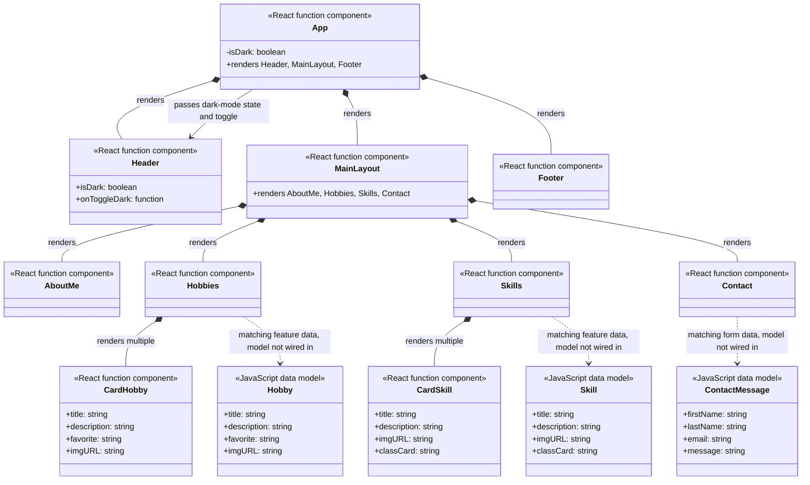

# My-First-React-App Class diagram

```mermaid
classDiagram
    direction TB

    class App {
        <<React function component>>
        -isDark: boolean
        +renders Header, MainLayout, Footer
    }

    class Header {
        <<React function component>>
        +isDark: boolean
        +onToggleDark: function
    }

    class MainLayout {
        <<React function component>>
        +renders AboutMe, Hobbies, Skills, Contact
    }

    class AboutMe {
        <<React function component>>
    }

    class Hobbies {
        <<React function component>>
    }

    class CardHobby {
        <<React function component>>
        +title: string
        +description: string
        +favorite: string
        +imgURL: string
    }

    class Skills {
        <<React function component>>
    }

    class CardSkill {
        <<React function component>>
        +title: string
        +description: string
        +imgURL: string
        +classCard: string
    }

    class Contact {
        <<React function component>>
    }

    class Footer {
        <<React function component>>
    }

    class Hobby {
        <<JavaScript data model>>
        +title: string
        +description: string
        +favorite: string
        +imgURL: string
    }

    class Skill {
        <<JavaScript data model>>
        +title: string
        +description: string
        +imgURL: string
        +classCard: string
    }

    class ContactMessage {
        <<JavaScript data model>>
        +firstName: string
        +lastName: string
        +email: string
        +message: string
    }

    App *-- Header : renders
    App *-- MainLayout : renders
    App *-- Footer : renders
    MainLayout *-- AboutMe : renders
    MainLayout *-- Hobbies : renders
    MainLayout *-- Skills : renders
    MainLayout *-- Contact : renders
    Hobbies *-- CardHobby : renders multiple
    Skills *-- CardSkill : renders multiple
    App --> Header : passes dark-mode state and toggle

    Hobbies ..> Hobby : matching feature data, model not wired in
    Skills ..> Skill : matching feature data, model not wired in
    Contact ..> ContactMessage : matching form data, model not wired in
```
